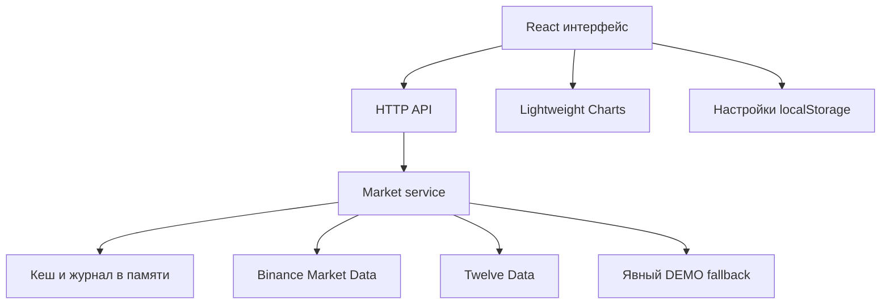

# Архитектура

## Обзор

Приложение разделено на доменную модель, серверный сервис рыночных данных и клиентскую рабочую область. Одна реализация backend обслуживает два независимых окружения: Cloudflare Worker (опубликованная версия) и обычный Node HTTP server (самостоятельная поставка).

## Слои

| Слой                | Каталог             | Ответственность                                                     |
| ------------------- | ------------------- | ------------------------------------------------------------------- |
| Domain              | `src/domain`        | Инструменты, OHLC, provenance, таймфреймы, схема будущего workspace |
| Application/backend | `src/server`        | HTTP-интеграции, нормализация, кеш, ошибки, логирование             |
| UI                  | `src/components`    | Страницы, фильтры, список, график, диалоги                          |
| Client lifecycle    | `src/hooks`         | Загрузка, отмена запросов, polling, локальные настройки             |
| Hosted adapter      | `app/api`, `worker` | Fetch-совместимый HTTP транспорт                                    |
| Standalone adapter  | `standalone`        | Node HTTP, локальные assets, SPA navigation fallback                |

Backend не зависит от React и не рендерит графики. График получает нормализованные Candle[], а не Binance JSON. Добавление провайдера требует адаптера на сервере, а не изменения формы данных клиента.

## Маршрутизация

`/` — обзор рынков. `/pair/:symbol` — рабочая область инструмента. Переход по инструменту использует обычную ссылку, поэтому прямой URL, новая вкладка, перезагрузка и история браузера работают и в hosted, и в standalone варианте. Локальные предпочтения переживают переход.

В hosted-версии маршруты обслуживает Vinext с React Server Components. В standalone — компактный клиентский entrypoint монтирует тот же Terminal; Node отдаёт index.html только для разрешённых UI-маршрутов. Неизвестные статические пути возвращают 404.

## Жизненный цикл данных

1. Клиент запрашивает `/api/markets` или `/api/candles`.
2. Backend проверяет символ и interval по допустимым значениям.
3. При свежем кеше возвращает результат; одновременно выполняющиеся одинаковые запросы объединяет.
4. При необходимости выполняет запрос поставщику с таймаутом 8 секунд.
5. Данные нормализуются и снабжаются source/provider/asOf.
6. Ошибка поставщика создаёт WARN и явный demo-response. Ошибка собственного сервера создаёт ERROR/HTTP 500.
7. Клиент обновляет свечи через `setData` без пересоздания chart instance; масштаб сохраняется при polling.
8. При смене URL или размонтировании AbortController отменяет старый запрос. Счётчик версии дополнительно запрещает позднему ответу перезаписать новое состояние.

Кеш котировок: 30 секунд. Кеш свечей: 15 секунд. `refresh=1` обходит TTL; уже выполняющийся одинаковый запрос переиспользуется. Кеш максимум 250 ключей, журнал максимум 100 записей; API логов возвращает последние 60. Durable storage отсутствует.

## Состояние

Состояние фильтров и текущего таймфрейма живёт в React и сбрасывается при полном переходе на другую страницу. В localStorage сохраняются `vector.theme.v1`, `vector.accent.v1`, `vector.chart.v1`, `vector.favorites.v1`, `vector.indicators.v1`. Последний ключ содержит словарь экземпляров индикаторов по symbol.

`WorkspaceDocument` описывает будущую схему с несколькими PaneState. Сейчас работает один график. Контракт не означает реализованный layout manager; порядок внедрения описан в EXTENDING.md.

## Точность и время

В API время свечи — UNIX seconds UTC. Binance миллисекунды преобразуются в секунды. Для Twelve Data явно запрашивается UTC. Свечи приходят в возрастающем порядке. У незакрытой свечи close/high/low могут изменяться при следующем опросе.

Цена сравнения курсора берётся из `coordinateToPrice(y)`, а не из OHLC выбранной свечи. Это позволяет измерять любое положение по оси цены. Опорная текущая цена — close последней свечи.

## Масштабирование эксплуатации

Standalone рассчитан на один процесс для персонального терминала. В нескольких экземплярах и в Workers кеш, uptime, статусы и журналы не являются общими. Для нагрузки потребуется общий Redis/KV, rate limiter, поток котировок и централизованные логи. В этой версии такой инфраструктуры нет.
