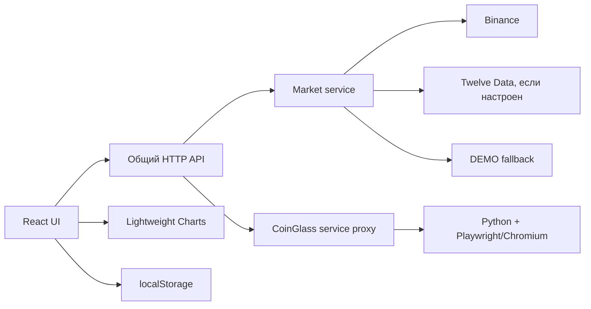

# Архитектура

Актуально для DiVMoney 0.2.0. Для навигации по исходникам см. [карту проекта](PROJECT_MAP.md).

```mermaid
flowchart LR
  UI[React UI] --> API[Общий HTTP API]
  API --> Market[Market service]
  Market --> Binance[Binance]
  Market --> Twelve[Twelve Data, если настроен]
  Market --> Demo[DEMO fallback]
  API --> CG[CoinGlass service proxy]
  CG --> Worker[Python + Playwright/Chromium]
  UI --> Chart[Lightweight Charts]
  UI --> Store[localStorage]
```

## Приложение

`src/domain` содержит доменные типы и сериализуемое состояние; `src/server` — обработчики данных/интеграций; `src/hooks` — клиентская загрузка, polling и состояние; `src/components` — страницы, график и UI. Расчёты индикаторов находятся в `src/indicators`. Общий React UI используется разными адаптерами: `app/` для hosted-сборки и `standalone/` для Node.js.

Источники рыночных данных нормализуются в `Market` и `Candle`; график не получает vendor JSON. При ошибке поставщика возможен явно маркированный DEMO fallback. Свечная история загружается при входе/смене интервала, активная страница пары обновляет последние свечи периодически. Таймеры и запросы останавливаются при скрытии вкладки или размонтировании.

## Состояние интерфейса

Тема, избранное, цвета графика, индикаторы и разметка хранятся локально в браузере. Общие настройки страницы и навигации задаются общими компонентами. Состояние индикаторов сериализуемое; объекты Chart API не сохраняются. `WorkspaceDocument` описывает структуру рабочих областей, но сама схема не означает поддержку многопанельного layout.

Индикатор имеет вычисление, настройки экземпляра, видимость и отображение. Переключение видимости оставляет индикатор в списке, удаление удаляет экземпляр. Fixed Range Volume Profile хранится как разметка и пересчитывается из свечей выбранного диапазона.

## CoinGlass

`src/server/coinglass-service.ts` проверяет и проксирует запросы в Python-сервис. Маршруты разделены на группы: обычные `/api/coinglass/*`, Model 3 `/api/coinglass/heatmap-*`, Fear & Greed `/api/coinglass/fear-greed-*` и RSI Heatmap `/api/coinglass/rsi-heatmap-*`. Python-сервис использует одну очередь и постоянную браузерную сессию CoinGlass. Долгоживущие результаты сохраняются в Docker volume; настройки интерфейса — в браузере.

Model 3 содержит временные ячейки. При проекции на свечи координата времени преобразуется в логическую координату текущего графика; видимые уровни ограничиваются доступным рядом свечей. Пересчёт при timeframe/масштабе сохраняет историческую позицию ячеек, включая дробные координаты между свечами.

## Серверные адаптеры

- Hosted: `app/api/*/route.ts` передаёт запрос общим обработчикам приложения.
- Standalone: `standalone/server.ts` обслуживает тот же API и assets собранного клиента.
- CoinGlass: обоим адаптерам требуется адрес `COINGLASS_SERVICE_URL`; токен задаётся серверным `COINGLASS_TOKEN`.

Основные команды и параметры запуска описаны в [README](../README.md) и [руководстве эксплуатации](OPERATIONS.md). Подробности контрактов HTTP — в [API.md](API.md).
